# Stanford CS224N: NLP with Deep Learning | Spring 2024

## Lecture 1 - Intro and Word Vectors

- Language is a very deep consept that allows us to achieve a lot of things. It is complex and changing.

### P: (word2vec) Efficient Estimation of Word Representations in Vector Space

They introduced the idea of presenting the words as vectors:
- we have a large corpus ("body" (corpora in plural)) of text:a long list of words
- go through each position _t_ in the text, which has a center word _c_ and context ("outside") word _o_
- use the similarity of the word vectors for _c_ and _o_ to calc the prob of _o_ given _c_ (or vice versa)
- keep adjusting the vectors to maximize this prob

 
- In the class the lecturer shows a very nice example of how exactly the minimization process is done at the end of the lecture.

## Lecture 2 - Word Vectors and Language Models

### SGD

Gradient decent is the idea to take small steps towards minimizing values of the objective function. It is ideal but in reality we usually use so-called _stochastic gradient decent_ (SGD). We take some mini batch from the data and calc the gradient on that. Empirically it is much better to do it that way.
Because the SGD method use mini batches it is naturally has some noice within it. Apparently, that is even better! More exploration is done and SGD gets even better results that other classical approaches.

### Word vectors

We initialize with random numbers and not with zeros. Otherwise, nothing works.
Word2vec works as magic.
You can do simple arithmetic with the word vectors and can get a lot of cultural, semantic, logical insights - and was one of the magical moments of the algorithm. It is so simple and yet captured so many things. 

The idea of the _negative sampling_ is to avoid the huge sum operation in the denominator over all words in a vocabulary. Instead, we can sample some random words and say that the prob of them needs to be low. They use sigmoid function there instead of exponent.

### How to evaluate word vectors?

- intrinsic eval - small internal task to check the model, fast to do
- extrinsic eval - complex "real-life" task, slow to do

### Nemed Entity Recognition (NER)

There we use the word vectors and try to learn the classification problem, e.g. is "Paris" a name or a location. It is done with labeled dataset with supervised learning.

## Lecture 3 - Backpropagation, Neural Network

The big idea of NN is that it is magical how there are self-organization processes that are going on while learning.

In the original idea of neurons pople used the step function that does not has a gradient.
So the trick was to use some functions tha do has gradients: logistic (sigmoid), tanh, hard tanh,  ReLU, Leaky ReLU, etc.

In the lecture he gave examples of math and backprop concepts.

## Lecture 4 - Dependency Parsing

- Phrase structure organizes words into nested constituents.
- Dependency structure shows which words depend on (modify, attach to, or are argument of) which other words.

Why is sentence structure needed for communication? - A model needs to understand sentence structure in order to be able to interpret language correctly.

In the assignment 2, they ask to build a dependency parser by ourselves.

An example of a parser:

## Lecture 5 - Recurrent Neural

For a long time NN were a nice idea that did not work at all in reality. But after 15-20 years people figured out the missing parts, and it turns out it was very small and simple tricks that helped.
- One of the tricks is **regularization**. Once done by adding some weights to the loss. Now it is more about the Dropout layers.
- Another trick is to use **vectorization** - use vectors instead of loops.
- Next trick - **parameter initialization**. Initialize weights to small random  values (not zero matrices).
- And there are **optimizers**. Use _Adam_.

_Language Modeling_ is the task of predicting what word comes next.
Another definition, a _language mode_ is a system that assigns a probability to a piece of text.

In the pre-learning era, there are many techniques for LMs. One of them is _n-gram Model_.

They are bad in terms of memory, context, probabilities, and more, but they are easy to build. And  nothing better were back then.
Surprisingly they produce grammatically not so bad texts.

Next era - neural language models.

Simple Fully Connected feed forward network with a single hidden layer did a bit better than n-grams, but still there are problems: window size is small, no positional embedding, not so scalable.

Next step - _Recurrent Neural Networks (RNN)_.

Pros:
- any length
- can use info from many steps back
- model size does not increase
- there is a symmetry in how inputs are processed

Cons:
- slow
- in practice, difficult to access info many steps back

In the lecture, it is described in detail how the training of RNNs works and some examples are shown.

## Lecture 6 - Sequence to Sequence

Back in a days, the common metric to measure how well the LM performs was _perplexity_ - inverse prob of corpus, according to LM. Lower perplexity is better.

There is inherent instability in RNNs. The gradient or explodes or vanishes in the process of training.
In practice, RNNs will only condition ~7 tokens back.

Then, the _Long Short-Term Memory (LSTM)_ models improved a bit RNNs.

The nice novel idea of LSTMs is the plus sign, when it adds the info from previous steps not by multiplying but by summation (similar to how people do it).
The LSTM architecture improved the memory to be ~100 tokens back instead of ~7 in RNNs.

_Neural Machine Translation (NMT)_ is a way to do Machine Translation with a single end-to-end neural network.

A new _seq2seq_ model was introduced. 

The _seq2seq_ model took over the world by just two years - all major companies adapted this seq2seq model for translation and other seq2seq tasks.

## Lecture 7 - Attention and LLM Intro

**How do we evaluate machine translation?**

Commonest way: BLEU (Bilingual Evaluation Understudy): compare the machine-written translation to one or several human-written translation(s), and computes a similarity _score based_ on:
- Geometric mean of n-gram precision (usually from 1 to 4 grams)
- Plus a penalty for too-short system translations  

It is good to have several translations, but in practice it is only one translation available.

BLUE is useful but imperfect: there are many valid translations, therefore, a good translation can achieve a low score.

**Why attention? Sequence-to-sequence: the bottleneck problem**

Idn LSTM-like architectures, everything in encoded in a single vector before it starts translate. Attention provides a solution to the bottleneck problem.

Core idea: on each step of the decoder, use direct connection to the encoder to focus on a particular part of the source sentence.

In the lecture, it is shown how to use this idea of attention together with LSTM. Google developed quite a good performing model with it.

Attention is great:
- significantly improves Neural MT performance
- provides a more "human-like" model for MT process
- solves the bottleneck problem
- helps with the vanishing gradient problem
- provides some interpretability; by inspecting attention distribution, we see what the decoder was focusing on

There are many ways how you can compute the _attention scores_ $e$ from $h$ and $s$ vectors:
- basic dot-product attention
- multiplicative attention
- reduced-rank multiplicative attention (the winner)
- additive attention

Example of dot-product attention:

Example of reduced-rank attention:

The details are in slides.

Attention can be used in many different areas other than MT.
A more general definition of attention:
> Given a set of vector _values_, and a vector _query_, **attention** is a technique to compute a weighted sum of the values, dependent on the query.

Intuition:
- The weighted sun is a _selective summary_ of the information contained in the values, where the query determines which values to focus on.
- Attention is a way to obtain a _fixed-size representation of an arbitrary set of representations_ (the values), dependent on some other representations (the query).
- Attention has become the powerful, flexible, general way pointer and memory manipulation in all DL models.
 
Next, in the lecture, the final project setting is discussed with some useful resources for ideas and datasets.

## Lecture 8 - Self-Attention and Transformers

Basically, before Transformers, most of the NLP tasks were addressed by some kind of LSTM systems. Then, researchers added an attention mechanism to LSTMs and it improved performance.

**Issues with recurrent models: linear interaction distance**

The RNN systems encode linear locality, bu the problem is that they take $O(sequence\: length)$ steps for distant word pairs to interact.
- hard to learn long-distance dependencies because of gradient problems
- linear order of words is "baked in"; we already know linear order isn't the right way to think about sentences

**Issues with recurrent models: lack of parallelizability**

Forward and backward passes have $O(sequence\: length)$ unparallelizable operations
- GPUs can perform a bunch of independent computations at once, but RNN hidden states can't be computed in full before past RNN hidden states have been computed
- Inhibits training on huge datasets

**How about attention?**

- the number of unparallelizable operations does not increase with sequence length
- all the words interact at every layer

We can think of **attention** as performing fuzzy lookup in a key-value store:

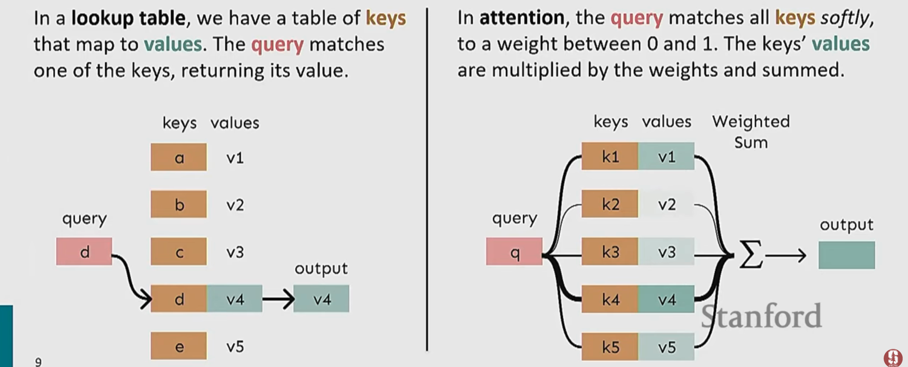

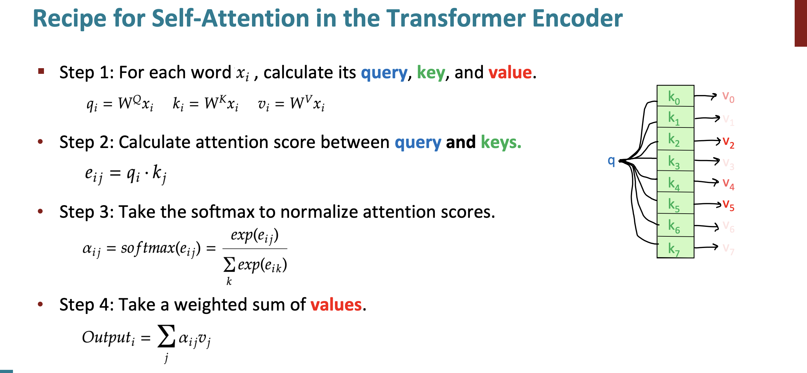

**Barriers and Solutions**

- Problem: Doesn't have an inherent notion of order
- Solution: learned absolute position representations: let all $p_i$ be learnable parameters! Learn a matrix $p \in R^{d \times n}$, and let each $p_i$ be _a column of that matrix_!

- Problem: nonlinearities for DL! It's all just weighted averages
- Easy fix: add a feed forward (FF) network to post-process each output vector

- Problem: need to ensure we don't "look at the future" when predicting a sequence, like a MT or language modeling
- Solution: to enable parallelization, we mask out attention to future words by setting attention scores to $-\infty$.

**Necessities for a self-attention building block** 

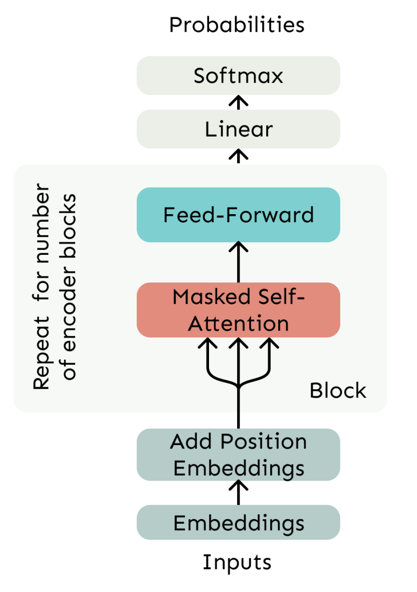

- self-attention: the basis of the method
- position representations: specify the sequence order, since self-attention is an unordered function of its input
- nonliniarities: at the output of the self attention block; frequently implemented as a simple FF network
- masking: to parallelize operations while not looking at the future; keeps information about the future from "leaking" to the past

Out of the box the self-attention mechanism is not working well by itself, and some crucial improvements are introduced in Transformers.

**Transformer model**

The first critical difference is the replacement of _Attention_ bu _Multi-Head Attention_.
But first, let's formulate our multiplications in form off matrices:

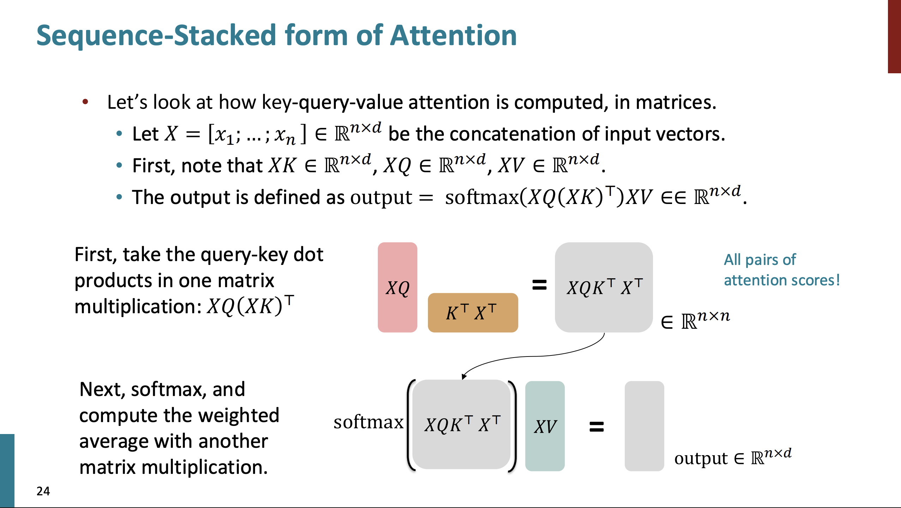

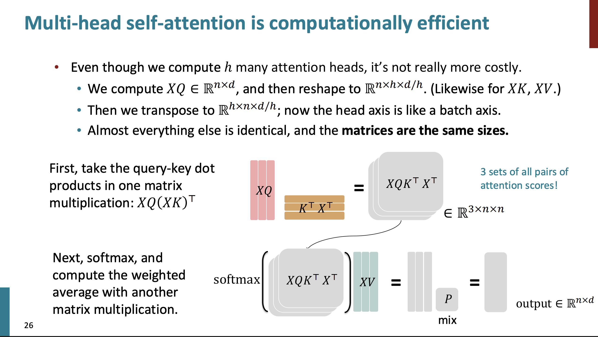

Another nice trick is called _Scaled Dot Product_. 
When dimentionality $d$ grows, the dot products between vectors tend to grow as well. To balance that we do a little trick by dividing the the attention scores by $\sqrt{\frac{d}{h}}$. 

Next, two optimization tricks:
- residual connections 
- layer normalization

In many Transformer diagrams, these are often written together as "Add & Norm".

Residual connections:

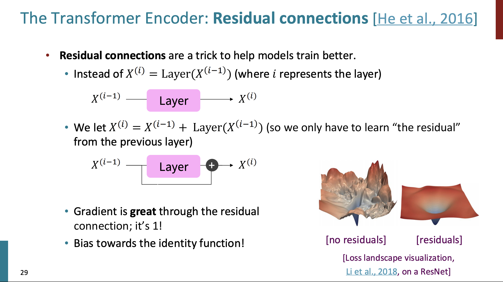

Layer normalization:

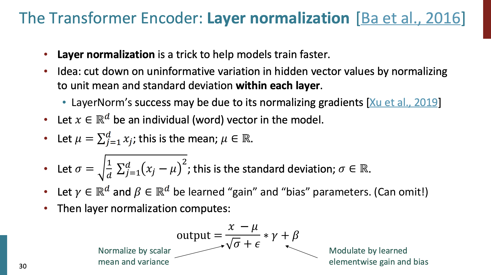

In practice, the $\gamma$ and $\beta$ parts are not so important.

That's it! We have out Transformer:
- self-attention
- Add & Norm
- FF
- Add & Norm

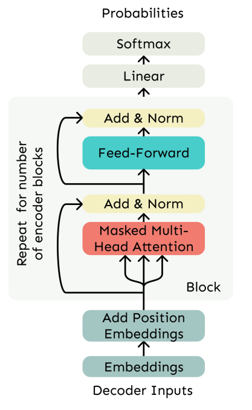

The **encoder** is _exactly_ like a **decoder** but _without Masking_.

**The Transformer Encoder-Decoder**

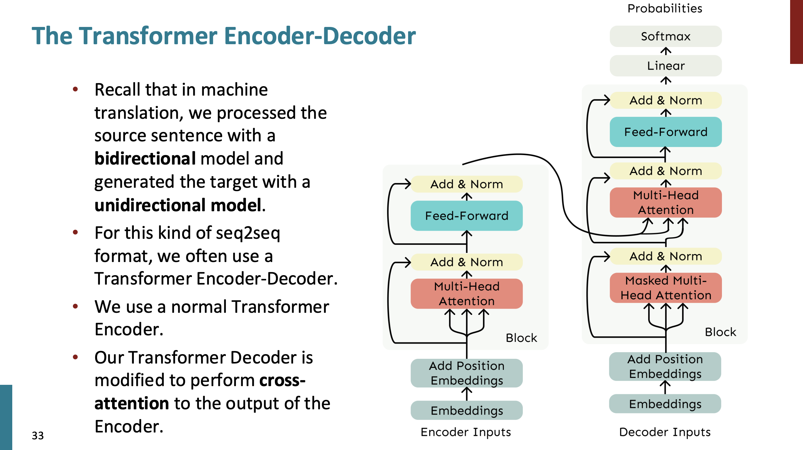

Pretty similar to the encoder and decoder that we saw before, but here we do some extra operation where we do so-called _cross-attention_. In the additional Multi-Head Attention layer, we use out decoder outputs as a queries and the encoder outputs as keys and values.

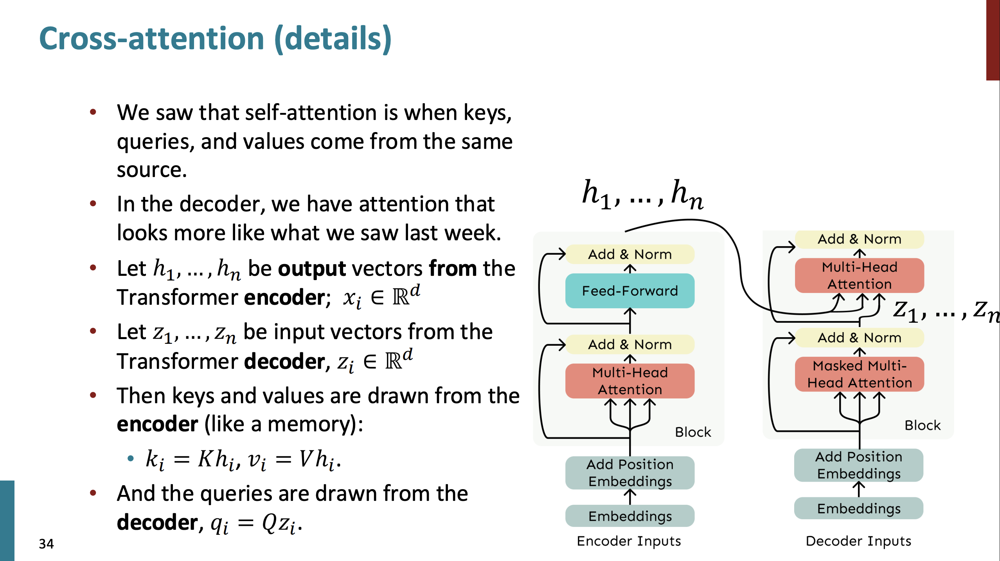

In all benchmarks, Transformers took over the field, and now almost every new model is a transformer-based model.

The problems:
- quadratic compute in self-attention
- position representation

## Lecture 9 - Pretraining

**Word structure and subword models**

We assume fixed vocabulary, and it is a problem, where we encounter new words or typos.
Now, to build vocabularies, we use sub-words. The example is the _byte-pair encoding algorithm_:
- start with letters and "end-of-word" symbols
- using a corpus of text, find the most common adjacent characters and add as a subword
- Replace instances of the character pair with the new sub-word; repeat until desired vocab size 

**Motivating word meaning and context**

Example: I record the record.

It is important to understand the context of the word to understand it correctly.

LLMs learn from the sentences with masked words and they try to predict the masked word.

- Step 1: pretrain on language modeling (predict next word)
- Step 2: finetune on your task (sentiment analysis, etc.)

So why not to pretrain to the final task from the beginning. Why we do the two steps anyway? Because the first stage is crucial really helps the training, and the researches are not sure why exactly. 
The intuition for this is that the general pretraining that has a lot of data (way more data than the data for finetuning) and can learn wonderful parameters to continue from for the other task. Maybe the right parameters for the other tasks are not far away from the pretrained ones.

To train an encoder, we use the masked words in the sentence and try to predict them. We chose the words to mask randomly.

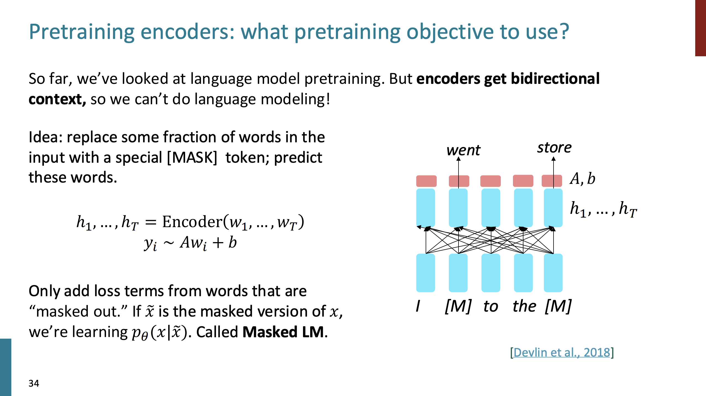

**BERT**

The BERT model is a classical example for the Encoder Transformer. The authors there proposed the "Masked LM". It is trained by masking the word in a sentence and replacing it with:
- the same word
- some random work
- the \[MASK\] token
The reason for this is that it learns not only from the \[MASK\] token but from random words and cases as well, so that it will be ready for any task.

BERT was massively popular and hugely versatile; finetuning BERT led to new SOTA results on a broad range of tasks:
- QQP: detect paraphrase questions
- QNLI: natural language inference over question answering data
- SST-2: sentiment analysis
- CoLA: detect whether sentences are grammatical
- STS-B: semantic textual similarity
- MRPC: microsoft paraphrase corpus
- RTE: natural language inference corpus

All of these metrics were for different kinds of algorithms where people finetuned their super special approach to get a bit better results on every metric. Then came BERT and shook the ground by outperforming everyone with a simple transformer model.

The BERT model took a lot of GPUs (relatively) to train. But a single GPU is enough to finetuning stage!
"_Pretrain once, finetune many times._"
We will not use BERT for text generation, because it was not trained for the task. Instead, it is perfect for classification and other similar tasks.
Some variations came after:
- RoBERTa: mainly just train BERT for longer and remove next sentence prediction
- SpanBERT: masking several words in raw (contiguous spans of words) makes a harder, more useful pretraining task

If you want to use BERT, just use RoBERTa instead - much better.

How you finetune networks? 

Encoder: You can finetune the whole network but it is memory expensive; you can pretrain some parts of networks; you can learn the prefix vectors that help to solve the task.

Encoder-Decoder: you can use regular language modeling pretraining; you can use span corruption (masking) for translations.

T5 is the encoder-decoder model that first showed some behavior of question answering like ChatGPT. It was finetuned via question-answer dataset.
 
Decoder: almost all biggest models in the world are Decoders. It is not sure why. Maybe because it is a little bit simpler and all the parameters are in one network and not in two distinct networks.  Decoder is a language model. Decoders cannot look into the future. It can also do sentiment analysis. All the techniques for finetuning that we discussed in the Encoder section are relevant for Decoder as well.

Then came GPT and GPT2 networks that worked the best at time. 

GPT3 was much bigger and showed learning even **without gradient steps** simply from examples you provide within their contexts.
This property that appeared in the large language models is quite significant new property that appeared to be very surprising. From the examples, it can do typo checking, translation, and even math!

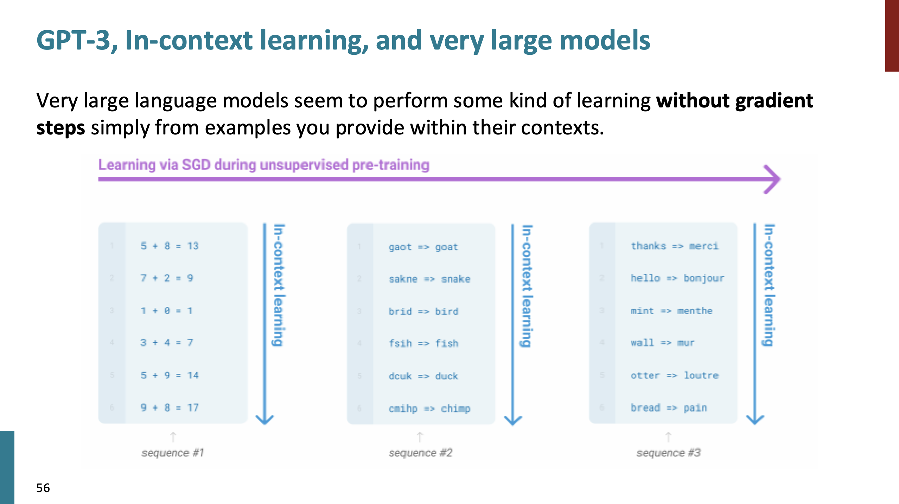

Why do LLMs are able to do such things is an open area of research (*by 2023). 
Another open question is how to find the best parameter-token balance to train these models. It costs a lot to train them.

In the Wei et al. (2023) research, the authors discovered that with a _chain-of-thought_ the models can produce even better answers, by providing in the first prompt some useful examples. Why this works - also on open question. These LLMs learned a lot of things about the language that researches did not expect: trivia, coreference, lexical semantics, sentiment, deep reasoning, basic arithmetic, and more.

## Lecture 10 - Post-training

## Credits

- [CS224N: Natural Language Processing with Deep Learning](https://web.stanford.edu/class/archive/cs/cs224n/cs224n.1246/)

