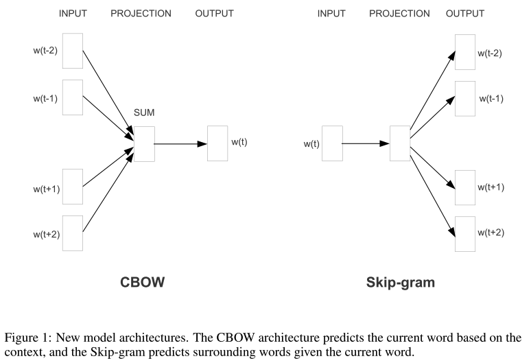
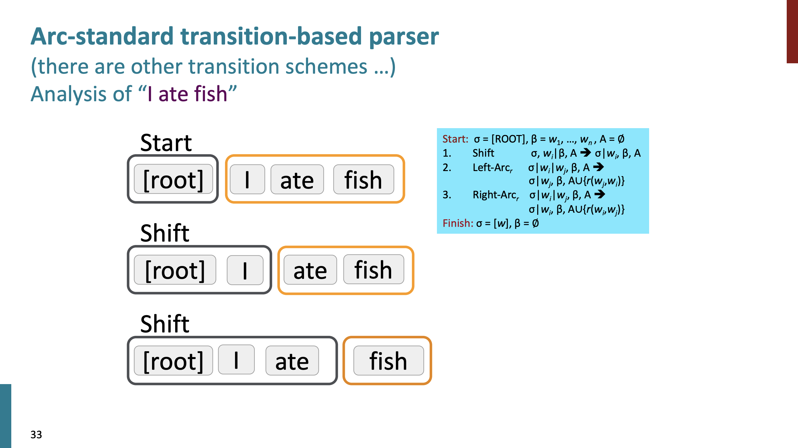
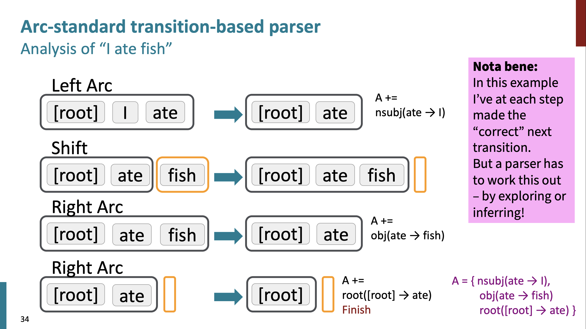
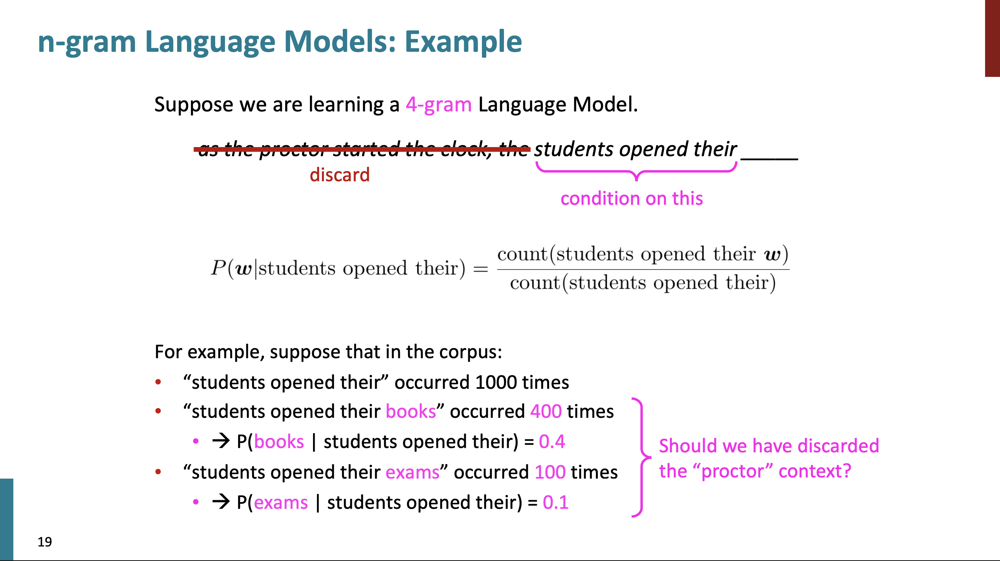
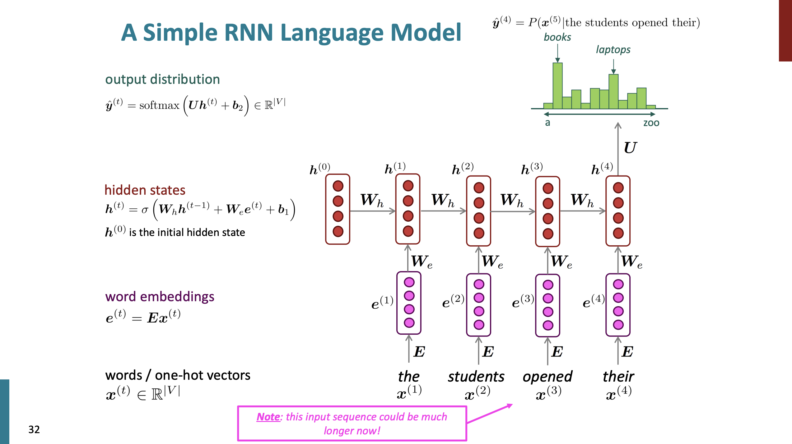
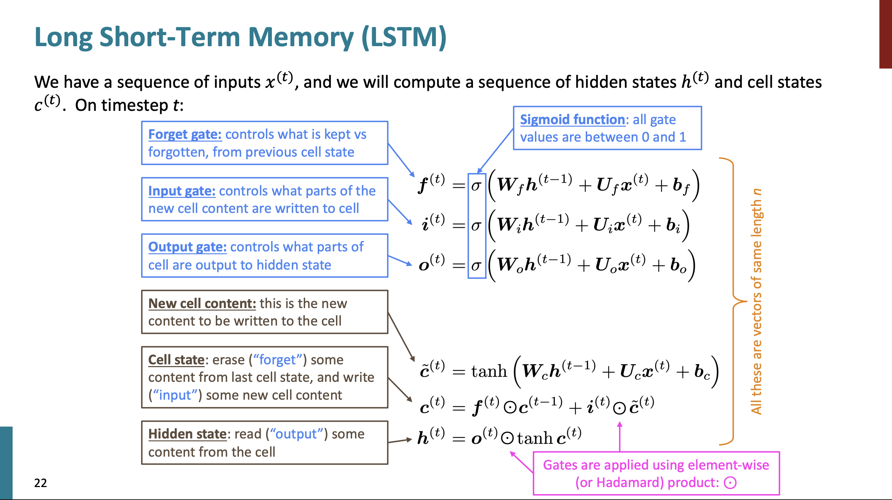
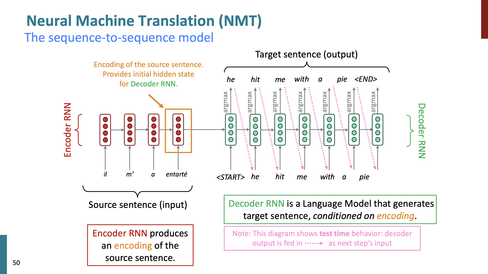
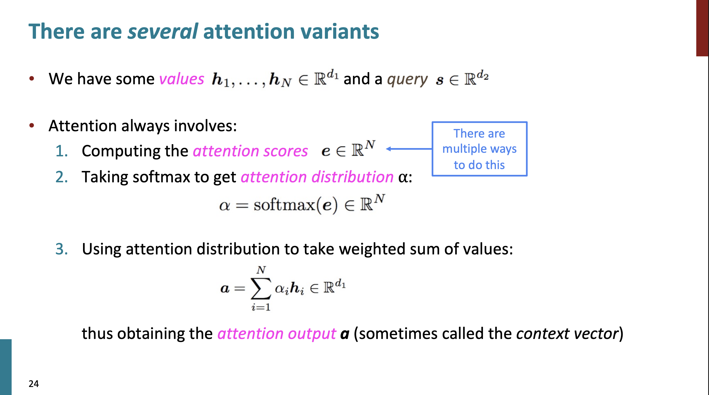
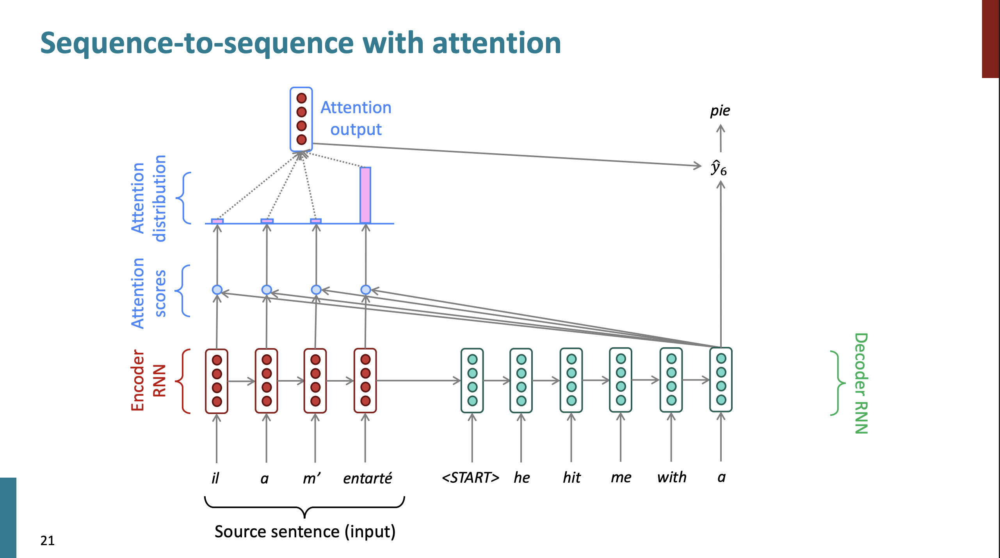
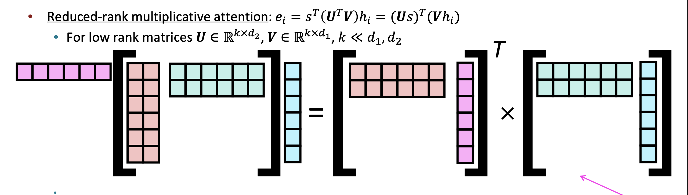

# Stanford CS224N: NLP with Deep Learning | Spring 2024

## Lecture 1 - Intro and Word Vectors

- Language is a very deep consept that allows us to achieve a lot of things. It is complex and changing.

### P: (word2vec) Efficient Estimation of Word Representations in Vector Space

They introduced the idea of presenting the words as vectors:
- we have a large corpus ("body" (corpora in plural)) of text:a long list of words
- go through each position _t_ in the text, which has a center word _c_ and context ("outside") word _o_
- use the similarity of the word vectors for _c_ and _o_ to calc the prob of _o_ given _c_ (or vice versa)
- keep adjusting the vectors to maximize this prob

 
- In the class the lecturer shows a very nice example of how exactly the minimization process is done at the end of the lecture.

## Lecture 2 - Word Vectors and Language Models

### SGD

Gradient decent is the idea to take small steps towards minimizing values of the objective function. It is ideal but in reality we usually use so-called _stochastic gradient decent_ (SGD). We take some mini batch from the data and calc the gradient on that. Empirically it is much better to do it that way.
Because the SGD method use mini batches it is naturally has some noice within it. Apparently, that is even better! More exploration is done and SGD gets even better results that other classical approaches.

### Word vectors

We initialize with random numbers and not with zeros. Otherwise, nothing works.
Word2vec works as magic.
You can do simple arithmetic with the word vectors and can get a lot of cultural, semantic, logical insights - and was one of the magical moments of the algorithm. It is so simple and yet captured so many things. 

The idea of the _negative sampling_ is to avoid the huge sum operation in the denominator over all words in a vocabulary. Instead, we can sample some random words and say that the prob of them needs to be low. They use sigmoid function there instead of exponent.

### How to evaluate word vectors?

- intrinsic eval - small internal task to check the model, fast to do
- extrinsic eval - complex "real-life" task, slow to do

### Nemed Entity Recognition (NER)

There we use the word vectors and try to learn the classification problem, e.g. is "Paris" a name or a location. It is done with labeled dataset with supervised learning.

## Lecture 3 - Backpropagation, Neural Network

The big idea of NN is that it is magical how there are self-organization processes that are going on while learning.

In the original idea of neurons pople used the step function that does not has a gradient.
So the trick was to use some functions tha do has gradients: logistic (sigmoid), tanh, hard tanh,  ReLU, Leaky ReLU, etc.

In the lecture he gave examples of math and backprop concepts.

## Lecture 4 - Dependency Parsing

- Phrase structure organizes words into nested constituents.
- Dependency structure shows which words depend on (modify, attach to, or are argument of) which other words.

Why is sentence structure needed for communication? - A model needs to understand sentence structure in order to be able to interpret language correctly.

In the assignment 2, they ask to build a dependency parser by ourselves.

An example of a parser:

## Lecture 5 - Recurrent Neural

For a long time NN were a nice idea that did not work at all in reality. But after 15-20 years people figured out the missing parts, and it turns out it was very small and simple tricks that helped.
- One of the tricks is **regularization**. Once done by adding some weights to the loss. Now it is more about the Dropout layers.
- Another trick is to use **vectorization** - use vectors instead of loops.
- Next trick - **parameter initialization**. Initialize weights to small random  values (not zero matrices).
- And there are **optimizers**. Use _Adam_.

_Language Modeling_ is the task of predicting what word comes next.
Another definition, a _language mode_ is a system that assigns a probability to a piece of text.

In the pre-learning era, there are many techniques for LMs. One of them is _n-gram Model_.

They are bad in terms of memory, context, probabilities, and more, but they are easy to build. And  nothing better were back then.
Surprisingly they produce grammatically not so bad texts.

Next era - neural language models.

Simple Fully Connected feed forward network with a single hidden layer did a bit better than n-grams, but still there are problems: window size is small, no positional embedding, not so scalable.

Next step - _Recurrent Neural Networks (RNN)_.

Pros:
- any length
- can use info from many steps back
- model size does not increase
- there is a symmetry in how inputs are processed

Cons:
- slow
- in practice, difficult to access info many steps back

In the lecture, it is described in detail how the training of RNNs works and some examples are shown.

## Lecture 6 - Sequence to Sequence

Back in a days, the common metric to measure how well the LM performs was _perplexity_ - inverse prob of corpus, according to LM. Lower perplexity is better.

There is inherent instability in RNNs. The gradient or explodes or vanishes in the process of training.
In practice, RNNs will only condition ~7 tokens back.

Then, the _Long Short-Term Memory (LSTM)_ models improved a bit RNNs.

The nice novel idea of LSTMs is the plus sign, when it adds the info from previous steps not by multiplying but by summation (similar to how people do it).
The LSTM architecture improved the memory to be ~100 tokens back instead of ~7 in RNNs.

_Neural Machine Translation (NMT)_ is a way to do Machine Translation with a single end-to-end neural network.

A new _seq2seq_ model was introduced. 

The _seq2seq_ model took over the world by just two years - all major companies adapted this seq2seq model for translation and other seq2seq tasks.

## Lecture 7 - Attention and LLM Intro

**How do we evaluate machine translation?**

Commonest way: BLEU (Bilingual Evaluation Understudy): compare the machine-written translation to one or several human-written translation(s), and computes a similarity _score based_ on:
- Geometric mean of n-gram precision (usually from 1 to 4 grams)
- Plus a penalty for too-short system translations  

It is good to have several translations, but in practice it is only one translation available.

BLUE is useful but imperfect: there are many valid translations, therefore, a good translation can achieve a low score.

**Why attention? Sequence-to-sequence: the bottleneck problem**

Idn LSTM-like architectures, everything in encoded in a single vector before it starts translate. Attention provides a solution to the bottleneck problem.

Core idea: on each step of the decoder, use direct connection to the encoder to focus on a particular part of the source sentence.

In the lecture, it is shown how to use this idea of attention together with LSTM. Google developed quite a good performing model with it.

Attention is great:
- significantly improves Neural MT performance
- provides a more "human-like" model for MT process
- solves the bottleneck problem
- helps with the vanishing gradient problem
- provides some interpretability; by inspecting attention distribution, we see what the decoder was focusing on

There are many ways how you can compute the _attention scores_ $e$ from $h$ and $s$ vectors:
- basic dot-product attention
- multiplicative attention
- reduced-rank multiplicative attention (the winner)
- additive attention

Example of dot-product attention:

Example of reduced-rank attention:

The details are in slides.

Attention can be used in many different areas other than MT.
A more general definition of attention:
> Given a set of vector _values_, and a vector _query_, **attention** is a technique to compute a weighted sum of the values, dependent on the query.

Intuition:
- The weighted sun is a _selective summary_ of the information contained in the values, where the query determines which values to focus on.
- Attention is a way to obtain a _fixed-size representation of an arbitrary set of representations_ (the values), dependent on some other representations (the query).
- Attention has become the powerful, flexible, general way pointer and memory manipulation in all DL models.
 
Next, in the lecture, the final project setting is discussed with some useful resources for ideas and datasets.

## Lecture 8 - Self-Attention and Transformers

Basically, before Transformers, most of the NLP tasks were addressed by some kind of LSTM systems. Then, researchers added an attention mechanism to LSTMs and it improved performance.

**Issues with recurrent models: linear interaction distance**

## Credits

- [CS224N: Natural Language Processing with Deep Learning](https://web.stanford.edu/class/archive/cs/cs224n/cs224n.1246/)

