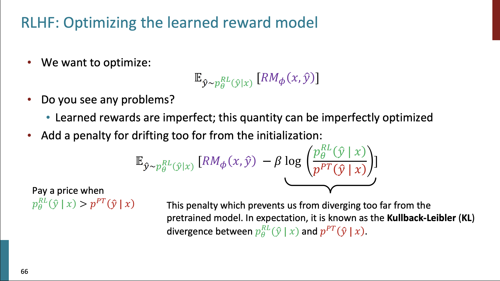

# Stanford CS224N: NLP with Deep Learning | Spring 2024

**GPUs from:**
- google colab
- kaggle notebooks
- together AI

## Contents

- Lecture 1 - Intro and Word Vectors
- Lecture 2 - Word Vectors and Language Models
- Lecture 3 - Backpropagation, Neural Network
- Lecture 4 - Dependency Parsing
- Lecture 5 - Recurrent Neural
- Lecture 6 - Sequence to Sequence
- Lecture 7 - Attention and LLM Intro
- Lecture 8 - Self-Attention and Transformers
- Lecture 9 - Pretraining
- Lecture 10 - Post-training
- Lecture 11 - Benchmarking
- Lecture 12 - Efficient Training
- Lecture 13 - Speech Brain-Computer Interfaces for Restoring Natural Communication
- Lecture 14 - Reasoning and Agents
- Lecture 15 - Life After DPO
- Lecture 16 - ConvNets and TreeRNNs
- Lecture 17 - Multimodal Deep Learning
- Lecture 18 - NLP, Linguistics, Philosophy
- Credits

## Lecture 1 - Intro and Word Vectors

- Language is a very deep consept that allows us to achieve a lot of things. It is complex and changing.

### P: (word2vec) Efficient Estimation of Word Representations in Vector Space

They introduced the idea of presenting the words as vectors:
- we have a large corpus ("body" (corpora in plural)) of text ,which is just a long list of words
- go through each position _t_ in the text, which has a center word _c_ and context ("outside") word _o_
- use the similarity of the word vectors for _c_ and _o_ to calc the prob of _o_ given _c_ (or vice versa)
- keep adjusting the vectors to maximize this prob

 
- In the class the lecturer shows a very nice example of how exactly the minimization process is done at the end of the lecture.

## Lecture 2 - Word Vectors and Language Models

### SGD

Gradient decent is the idea to take small steps towards minimizing values of the objective function. It is ideal but in reality we usually use so-called _stochastic gradient decent_ (SGD). We take some mini batch from the data and calc the gradient on that. Empirically it is much better to do it that way.
Because the SGD method use mini batches it is naturally has some noice within it. Apparently, that is even better! More exploration is done and SGD gets even better results that other classical approaches.

### Word vectors

We initialize with random numbers and not with zeros. Otherwise, nothing works.
Word2vec works as magic.
You can do simple arithmetic with the word vectors and can get a lot of cultural, semantic, logical insights - and was one of the magical moments of the algorithm. It is so simple and yet captured so many things. 

The idea of the _negative sampling_ is to avoid the huge sum operation in the denominator over all words in a vocabulary. Instead, we can sample some random words and say that the prob of them needs to be low. They use sigmoid function there instead of exponent.

### How to evaluate word vectors?

- intrinsic eval - small internal task to check the model, fast to do
- extrinsic eval - complex "real-life" task, slow to do

### Nemed Entity Recognition (NER)

There we use the word vectors and try to learn the classification problem, e.g. is "Paris" a name or a location. It is done with labeled dataset with supervised learning.

## Lecture 3 - Backpropagation, Neural Network

The big idea of NN is that it is magical how there are self-organization processes that are going on while learning.

In the original idea of neurons pople used the step function that does not has a gradient.
So the trick was to use some functions tha do has gradients: logistic (sigmoid), tanh, hard tanh,  ReLU, Leaky ReLU, etc.

In the lecture he gave examples of math and backprop concepts.

## Lecture 4 - Dependency Parsing

- Phrase structure organizes words into nested constituents.
- Dependency structure shows which words depend on (modify, attach to, or are argument of) which other words.

Why is sentence structure needed for communication? - A model needs to understand sentence structure in order to be able to interpret language correctly.

In the assignment 2, they ask to build a dependency parser by ourselves.

An example of a parser:

## Lecture 5 - Recurrent Neural

For a long time NN were a nice idea that did not work at all in reality. But after 15-20 years people figured out the missing parts, and it turns out it was very small and simple tricks that helped.
- One of the tricks is **regularization**. Once done by adding some weights to the loss. Now it is more about the Dropout layers.
- Another trick is to use **vectorization** - use vectors instead of loops.
- Next trick - **parameter initialization**. Initialize weights to small random  values (not zero matrices).
- And there are **optimizers**. Use _Adam_.

_Language Modeling_ is the task of predicting what word comes next.
Another definition, a _language mode_ is a system that assigns a probability to a piece of text.

In the pre-learning era, there are many techniques for LMs. One of them is _n-gram Model_.

They are bad in terms of memory, context, probabilities, and more, but they are easy to build. And  nothing better were back then.
Surprisingly they produce grammatically not so bad texts.

Next era - neural language models.

Simple Fully Connected feed forward network with a single hidden layer did a bit better than n-grams, but still there are problems: window size is small, no positional embedding, not so scalable.

Next step - _Recurrent Neural Networks (RNN)_.

Pros:
- any length
- can use info from many steps back
- model size does not increase
- there is a symmetry in how inputs are processed

Cons:
- slow
- in practice, difficult to access info many steps back

In the lecture, it is described in detail how the training of RNNs works and some examples are shown.

## Lecture 6 - Sequence to Sequence

Back in a days, the common metric to measure how well the LM performs was _perplexity_ - inverse prob of corpus, according to LM. Lower perplexity is better.

There is inherent instability in RNNs. The gradient or explodes or vanishes in the process of training.
In practice, RNNs will only condition ~7 tokens back.

Then, the _Long Short-Term Memory (LSTM)_ models improved a bit RNNs.

The nice novel idea of LSTMs is the plus sign, when it adds the info from previous steps not by multiplying but by summation (similar to how people do it).
The LSTM architecture improved the memory to be ~100 tokens back instead of ~7 in RNNs.

_Neural Machine Translation (NMT)_ is a way to do Machine Translation with a single end-to-end neural network.

A new _seq2seq_ model was introduced. 

The _seq2seq_ model took over the world by just two years - all major companies adapted this seq2seq model for translation and other seq2seq tasks.

## Lecture 7 - Attention and LLM Intro

**How do we evaluate machine translation?**

Commonest way: BLEU (Bilingual Evaluation Understudy): compare the machine-written translation to one or several human-written translation(s), and computes a similarity _score based_ on:
- Geometric mean of n-gram precision (usually from 1 to 4 grams)
- Plus a penalty for too-short system translations  

It is good to have several translations, but in practice it is only one translation available.

BLUE is useful but imperfect: there are many valid translations, therefore, a good translation can achieve a low score.

**Why attention? Sequence-to-sequence: the bottleneck problem**

Idn LSTM-like architectures, everything in encoded in a single vector before it starts translate. Attention provides a solution to the bottleneck problem.

Core idea: on each step of the decoder, use direct connection to the encoder to focus on a particular part of the source sentence.

In the lecture, it is shown how to use this idea of attention together with LSTM. Google developed quite a good performing model with it.

Attention is great:
- significantly improves Neural MT performance
- provides a more "human-like" model for MT process
- solves the bottleneck problem
- helps with the vanishing gradient problem
- provides some interpretability; by inspecting attention distribution, we see what the decoder was focusing on

There are many ways how you can compute the _attention scores_ $e$ from $h$ and $s$ vectors:
- basic dot-product attention
- multiplicative attention
- reduced-rank multiplicative attention (the winner)
- additive attention

Example of dot-product attention:

Example of reduced-rank attention:

The details are in slides.

Attention can be used in many different areas other than MT.
A more general definition of attention:
> Given a set of vector _values_, and a vector _query_, **attention** is a technique to compute a weighted sum of the values, dependent on the query.

Intuition:
- The weighted sun is a _selective summary_ of the information contained in the values, where the query determines which values to focus on.
- Attention is a way to obtain a _fixed-size representation of an arbitrary set of representations_ (the values), dependent on some other representations (the query).
- Attention has become the powerful, flexible, general way pointer and memory manipulation in all DL models.
 
Next, in the lecture, the final project setting is discussed with some useful resources for ideas and datasets.

## Lecture 8 - Self-Attention and Transformers

Basically, before Transformers, most of the NLP tasks were addressed by some kind of LSTM systems. Then, researchers added an attention mechanism to LSTMs and it improved performance.

**Issues with recurrent models: linear interaction distance**

The RNN systems encode linear locality, bu the problem is that they take $O(sequence\: length)$ steps for distant word pairs to interact.
- hard to learn long-distance dependencies because of gradient problems
- linear order of words is "baked in"; we already know linear order isn't the right way to think about sentences

**Issues with recurrent models: lack of parallelizability**

Forward and backward passes have $O(sequence\: length)$ unparallelizable operations
- GPUs can perform a bunch of independent computations at once, but RNN hidden states can't be computed in full before past RNN hidden states have been computed
- Inhibits training on huge datasets

**How about attention?**

- the number of unparallelizable operations does not increase with sequence length
- all the words interact at every layer

We can think of **attention** as performing fuzzy lookup in a key-value store:

**Barriers and Solutions**

- Problem: Doesn't have an inherent notion of order
- Solution: learned absolute position representations: let all $p_i$ be learnable parameters! Learn a matrix $p \in R^{d \times n}$, and let each $p_i$ be _a column of that matrix_!

- Problem: nonlinearities for DL! It's all just weighted averages
- Easy fix: add a feed forward (FF) network to post-process each output vector

- Problem: need to ensure we don't "look at the future" when predicting a sequence, like a MT or language modeling
- Solution: to enable parallelization, we mask out attention to future words by setting attention scores to $-\infty$.

**Necessities for a self-attention building block** 

- self-attention: the basis of the method
- position representations: specify the sequence order, since self-attention is an unordered function of its input
- nonliniarities: at the output of the self attention block; frequently implemented as a simple FF network
- masking: to parallelize operations while not looking at the future; keeps information about the future from "leaking" to the past

Out of the box the self-attention mechanism is not working well by itself, and some crucial improvements are introduced in Transformers.

**Transformer model**

The first critical difference is the replacement of _Attention_ bu _Multi-Head Attention_.
But first, let's formulate our multiplications in form off matrices:

Another nice trick is called _Scaled Dot Product_. 
When dimentionality $d$ grows, the dot products between vectors tend to grow as well. To balance that we do a little trick by dividing the the attention scores by $\sqrt{\frac{d}{h}}$. 

Next, two optimization tricks:
- residual connections 
- layer normalization

In many Transformer diagrams, these are often written together as "Add & Norm".

Residual connections:

Layer normalization:

In practice, the $\gamma$ and $\beta$ parts are not so important.

That's it! We have out Transformer:
- self-attention
- Add & Norm
- FF
- Add & Norm

The **encoder** is _exactly_ like a **decoder** but _without Masking_.

**The Transformer Encoder-Decoder**

Pretty similar to the encoder and decoder that we saw before, but here we do some extra operation where we do so-called _cross-attention_. In the additional Multi-Head Attention layer, we use out decoder outputs as a queries and the encoder outputs as keys and values.

In all benchmarks, Transformers took over the field, and now almost every new model is a transformer-based model.

The problems:
- quadratic compute in self-attention
- position representation

## Lecture 9 - Pretraining

**Word structure and subword models**

We assume fixed vocabulary, and it is a problem, where we encounter new words or typos.
Now, to build vocabularies, we use sub-words. The example is the _byte-pair encoding algorithm_:
- start with letters and "end-of-word" symbols
- using a corpus of text, find the most common adjacent characters and add as a subword
- Replace instances of the character pair with the new sub-word; repeat until desired vocab size 

**Motivating word meaning and context**

Example: I record the record.

It is important to understand the context of the word to understand it correctly.

LLMs learn from the sentences with masked words and they try to predict the masked word.

- Step 1: pretrain on language modeling (predict next word)
- Step 2: finetune on your task (sentiment analysis, etc.)

So why not to pretrain to the final task from the beginning. Why we do the two steps anyway? Because the first stage is crucial really helps the training, and the researches are not sure why exactly. 
The intuition for this is that the general pretraining that has a lot of data (way more data than the data for finetuning) and can learn wonderful parameters to continue from for the other task. Maybe the right parameters for the other tasks are not far away from the pretrained ones.

To train an encoder, we use the masked words in the sentence and try to predict them. We chose the words to mask randomly.

**BERT**

The BERT model is a classical example for the Encoder Transformer. The authors there proposed the "Masked LM". It is trained by masking the word in a sentence and replacing it with:
- the same word
- some random work
- the \[MASK\] token
The reason for this is that it learns not only from the \[MASK\] token but from random words and cases as well, so that it will be ready for any task.

BERT was massively popular and hugely versatile; finetuning BERT led to new SOTA results on a broad range of tasks:
- QQP: detect paraphrase questions
- QNLI: natural language inference over question answering data
- SST-2: sentiment analysis
- CoLA: detect whether sentences are grammatical
- STS-B: semantic textual similarity
- MRPC: microsoft paraphrase corpus
- RTE: natural language inference corpus

All of these metrics were for different kinds of algorithms where people finetuned their super special approach to get a bit better results on every metric. Then came BERT and shook the ground by outperforming everyone with a simple transformer model.

The BERT model took a lot of GPUs (relatively) to train. But a single GPU is enough to finetuning stage!
"_Pretrain once, finetune many times._"
We will not use BERT for text generation, because it was not trained for the task. Instead, it is perfect for classification and other similar tasks.
Some variations came after:
- RoBERTa: mainly just train BERT for longer and remove next sentence prediction
- SpanBERT: masking several words in raw (contiguous spans of words) makes a harder, more useful pretraining task

If you want to use BERT, just use RoBERTa instead - much better.

How you finetune networks? 

Encoder: You can finetune the whole network but it is memory expensive; you can pretrain some parts of networks; you can learn the prefix vectors that help to solve the task.

Encoder-Decoder: you can use regular language modeling pretraining; you can use span corruption (masking) for translations.

T5 is the encoder-decoder model that first showed some behavior of question answering like ChatGPT. It was finetuned via question-answer dataset.
 
Decoder: almost all biggest models in the world are Decoders. It is not sure why. Maybe because it is a little bit simpler and all the parameters are in one network and not in two distinct networks.  Decoder is a language model. Decoders cannot look into the future. It can also do sentiment analysis. All the techniques for finetuning that we discussed in the Encoder section are relevant for Decoder as well.

Then came GPT and GPT2 networks that worked the best at time. 

GPT3 was much bigger and showed learning even **without gradient steps** simply from examples you provide within their contexts.
This property that appeared in the large language models is quite significant new property that appeared to be very surprising. From the examples, it can do typo checking, translation, and even math!

Why do LLMs are able to do such things is an open area of research (*by 2023). 
Another open question is how to find the best parameter-token balance to train these models. It costs a lot to train them.

In the Wei et al. (2023) research, the authors discovered that with a _chain-of-thought_ the models can produce even better answers, by providing in the first prompt some useful examples. Why this works - also on open question. These LLMs learned a lot of things about the language that researches did not expect: trivia, coreference, lexical semantics, sentiment, deep reasoning, basic arithmetic, and more.

## Lecture 10 - Post-training

The scale of LLM training is enormous both in terms of the model sizes and in terms of data required to train the models.
IN the lecture, it is shown that a language model learns really deep concepts of world understanding, math, and more.

**emergent _zero-shot_ and _few-shot_ learning**

The great phenomenon is that GPT-2 has an ability for **emergent _zero-shot_ learning** just out of the context. It outperformed this way many benchmarks in many different tasks and metrics.
Example — summarization prompt: `<some artice> TL;DR:`

Another cool new property is the **emergent _few-shot_ learning**: put several examples in the context and then provide the task.
Example — translation prompt: `<word in english> => <its translation>, <word in english> => <its translation>, ..., <word in english> => <its translation>, <desired word to translate> =>` or similar example for logic. Crazy! ..isn't it?!

These models are still have their limits: harder richer tasks, multi-step reasoning. 
_Chain-of-thought (CoT) prompting_ push these boundaries even further. You show the model examples with reasoning steps. Then the models can imitate this for new questions.
Another trick is to write in the prompt: `A: Let's think step by step.` 
Manual CoT (showing several examples with reasoning) is still better, but this Zero-shot CoT (just say to it to think step-by-step) greatly outperforms the Zero-Shot GPT model that just does vanilla autocomplete.

These techniques, though, limit to what you can fit in context. 
Complex tasks will probably need gradient steps.

**Instruction finetuning**

BUt language modeling is not assisting users. LLMs learn to predict the next token, so how can we finetune them for assistant rather than trying to trick them to be one with some cleaver prompts? The instruction finetuning is the answer!
The recipe is:
- collect examples of (instruction, output) pairs across many tasks and finetune an LM
- Evaluate on unseen tasks

There are some huge data collections for this purpose with many examples of different tasks such as classification, sequence tagging, rewriting, translation, QA, etc.

How to evaluate such thing is a very tricky question. It is hard to evaluate those things, and one of the popular proposed solutions is the Massive Multitask Language Understanding (MMLU) benchmark that has 57 diverse knowledge-intensive tasks. Some models already crossed 90% success rate of the metric.

Once again, bigger models with bigger datasets - perform better.

How the finetuning data is structured, how much do we need, and how the data quality influences the result are still open questions.

There are some limitations for instruction finetuning as well:
- it is costly to collect high-quality data (some physics PhDs need to write answers)
- it is unclear what is the right answer to the open-ended questions (write me a poem)
- language modeling penalizes all token-level mistakes equally, but some errors are worse than others
- humans generate suboptimal answers 
- even with isntruction finetuning, there a mismatch between the LM objective and the objective of "satisfy human preferences" - can we do it direcly? let's see...

**Optimizing for human preferences (DPO/RLHF)**

There are three steps for RLHF: 

But how we get the reward model?

Human-in-the-loop is expensive.
Solution: instead of directly asking humans for preferences, model their preferences as a separate NLP problem.
 
But human judgments are noisy and miscalibrated.
Solution: instead of asking for direct ratings, ask for pairwise comparisons, which can be more reliable.

Train a reward model with some penalty for stabilizing:

How to optimize? - RL!

 

The difference between models with and without RLHF is very big - humans prefer answers from RLHF rather than from other humans.

RLHF is veeeery complicated, can we do something simpler? Yes - **Direct Preference Optimization** or DPO for short.

A lot of math there in DPO explanation. 
But the basic idea is that DPO takes the RM function and uses it to build a simple classification loss function that connects preference data to language models parameters directly.

  

Not sure which approach is the best.

With the introduction of RLHF/DPO, the LLM behaviours produce significantly more detailed, nicer, cleaner, organised answers.

## Lecture 11 - Benchmarking

Benchmarks are important. At different steps in the project different methods for evaluations are required.

Two major types of evaluations:
- Close-ended evaluations: with concrete labels
- Open-ended evaluations: without labels

### Close-Ended Evaluation

- limited number of potential answers 
- Often one or just a few correct answers 
- Enables automatic evaluation as in ML

Benchmarks (not full list):
- Sentiment analysis: SST / IMDB / Yelp ...
- Entailment: SNLI, CB, RTE
- Name entity recognition: CoNLL-2003
- Part-of-Speech: PTB
- Coreference resolution: WSC
- Question Answering: Squad 2
- Reading texts: BooIQ, MultiRC
- Close-ended multi-task benchmark: superGLUE

Metrics: accuracy / precision / recall / f1-score / ROC

### Open-Ended Evaluations

- long generations with too many possible correct answers to enumerate, can't use standard ML metrics
- There are now better and worse answers (not just rights or wrong)

- Examples:
- summarization: CNN-DM / Gigaword
- translation: WMT
- instruction-following: Chatbot Arena / AlpacaEval / MT-Bench

How to evaluate:
- Content overlap metrics
  - n-Gran overlap metrics: **BLEU** (precision), **ROUGE** (recall), METEOR, CIDEr, etc.
- Model-based metrics: use learned representations of words and sentences to compute semantic similarity between generated and reference texts. 
  - BERTSCORE did a good job to present s smart averaging of those embeddings with BERT to build the metric.
  - BLEURT: in this work they finetune the model specificaly to be good in the BLUE benchmark
  - Reference free evals: AlpacaEval (good), MT-Bench
- Human evaluations: gold standard in developing new automatic metrics
  - Ask humans to evaluate.
  - Disadvantages: slow, expensive, inter-annotator disagreement, intra-annotator disagreement, not reproducible, precision not recall, biases, how to select annotators, etc.

- Chatbot Arena: collect human votes to compute an ELO-based LLM leaderboard (like in chess).
  - huge community effort
  - new models take a long time to benchmark
  - only big guys are there 
- Another way to evaluate with is cheeper - use a LM evaluator
  - use a LM as a reference free evaluator
  - surprisingly high correlations with human
  - common versions: AlpacaEval, MT-bench
  - AlpacaFarm authors discovered that models has more agreement with humans than humans with themselves, because the models has less variance compared to real humans
  - AlpacaEval:

### Current Evaluation of LLM

- perplexity (inverse prob of corpus) for pretraining:
  - usually is highly correlates with downstream performance
  - hard to compare with different tokenizers

- Everything for pretraining and finetuned:
  - HELM
  - HF open-llm leaderboard
  - MMLU
- Arena-like for finetuned
  - let people decide

Usually, if a model performs well in code it performs well in reasoning as well, a nice correlation.

AgentBoard evaluates agents.

How to improve benchmarks?
- update the questions constantly
- check if the model too much sure about the answer - so it is sign that hte model was trained on the question
- reorder the questions to see the reaction of the model, it is was pretrained on the dataset

There are a lot of issues and challenges with evaluations that are discussed in the lecture.
One of the biggest challenges is that the researchers are not incentivized to compare with new metric.

Big take: do not blindly believe numbers, just check the outputs yourself.

Another take: use the metric that is best for your purpose.

## Lecture 12 - Efficient Training

### Mixed Precision Training

If CUDA OOM errors something to do with memory -> use FP16 instead of FP32 (`torch.float16`).

Some another trick that uses both 16 and32 floats.

In PyTorch you can play with the scaler option to implement the mixed precision:

But if we have very big and very small numbers? Just use `BFloat16` 8 bits of scale, 7 bits of precision - less precision compared to FP16, but the same scale as FP32. And it is ok for NN.

Using `BFloat16` makes the model faster cheaper, requiring less memory, and even gaining better results!

Not all GPUs can handle BFloat16 - check for it. 

### Multi-GPU Training with DDP / FSDP

To train the model with several GPUs there are some cleaver techniques to distribute and sinc the memory across the GPUs.

The first simplest method is Distributed Data Parallel:

Run different data chunks per every GPU, do the forward step, gather other updates from other GPUs. Do the backward step.

Another much better solution is to use ZeRO Stage-2: optimize state + gradient sharding. It gets more memory for free.

Next solution is to shard the parameters as well - ZeRO Stage-3 (Full FSDP):

Only the part of parameters are extracted every time (let's say if I do the forward pass on layer f1, only exptract the parameters to this layer, and then free them; that is how you preserve memory).

### Parameter Efficient Finetuning: LoRA

It is important to think about more efficient ways to do finetuning. It is not a small topic.

A nice trick to use to train less parameters is to use LoRA technique that adds a little bit additional low-rank parameters to weights of self-attention and train only them. It turns out very useful trick to do.

### To summarize

## Lecture 13 - Speech Brain-Computer Interfaces for Restoring Natural Communication

To understand the real human brain is a science by itself. It is a super challenging and important task.

## Lecture 14 - Reasoning and Agents

A very fresh topic in the world right now.

**What is reasoning?**

Using _facts_ and _logic_ to arrive at an answer.

**Deductive reasoning:** use logic to go from premise to firm conclusion

**Inductive reasoning:** from observation, predict a likely conclusion. Just describe the conclusion that you observe.

**Abductive reasoning:** from observation, predict the most likely explanation. Explain what is going on.

**Formal reasoning:** follows formal rules of logic along axiomatic knowledge to derive conclusions.

**Informal reasoning:** uses intuition, experience, common sense to arrive at answers.

For most of this lecture, be "reasoning" we mean informal deductive reasoning, ofter involving multiple steps.

**Can current LLMs reason?**

You can do reasoning via _chain-of-thought prompting_ by providing some examples of reasoning in the prompt itself.

Another surprising this is you can just use _zero-shot CoT prompting_ by saying to the model: `Let's think step by step`.

OR you can just sample the model multiple times and see which answer appears the most. Then, you return the answer. This method is called _CoT with self-consistency_. It works much better than the standard CoT.

Another way to do it is _ensemble prompting_, that is to ask the same question X number of times just in different forms. The _CoT with self-consistency_ is still better here. 
 
Least-to-Most prompting decomposes the query into sub-problems and cracks the problem one by one solving the sub-problems. This is much better than the standard CoT, but (!) with the right initial prompt, the standard CoT can be as good as other methods presented here.

 **Can we get reasoning-like behaviour with smaller LMs by teaching them to imitate larger models?**

We can do it via distillation. 
_Orca_ is an instruction-tuning small LMs with CoT rationales.
How to train:
- collect a wide variety of instructions from the FLAN-v2 collection
- Prompt GPT4 or ChatGPT with these instructions along with a system message
- Finetune Llama-13b on outputs generated via ChatGPT or GPT4

Evaluation: _BigBench-hard_, a collection of 23 Big-Bench tasks with a special focus on multi-step reasoning.

Orca-13B outperformed Vicuna-13B on BigBench-hard. 

Can we finetune the big model to do better at reasoning? 
ReSR^{EM} explores just that. It alternated between the following two steps:
- Generate (E-step): given reasoning problem, sample multiple from language model. Filter based on some (problem specific) function (e.g. correctness, etc.)
- Improve (M-step): update the LM to maximize the prob of filtered solutions, using supervised finetuning

It gives an improvement over the human-provided reasoning.

It was found that CoT rationales are often not faithful.

The researchers checked by changing a bit the questions (counterfractuals) if the models really reasons or just memorized the answers from the dataset. And yes there is  a drop in performance. 
- Draamtic drop in performance for GPT-4
- No drop in performance for humans

The conclusion: no systematic proof that the model really reasons.
 
**Language Model Agents**

 

There are many applications of
- natural language interfaces
- UI automation
- multi-step tool use
- etc.

Pre LLMs:
- Idea 1: directly map from instructions to action sequences like Machine Translation
- Idea 2: infer executable, structured plans from (instruction, trajectory) pairs and train a model to go from instructions to plans
- Idea 3: use RL to directly map instructions to actions

Nowadays:

 

Instead of complicated systems, just use a LM as a policy.
THe simplest way to do the task is to prompt LM in a loop the ReACT approach.

 

Examples for benchmark environment: 

_MiniWoB++_:
- not real world
- relatively short-horizon
- Zero-shot performance of even the biggest LLMs is far from perfect

_WebArena_:
- additional utility tools: maps, calculators, etc.
- multi-tab browsing
- long-horizon tasks
- evaluates functional correctness - the final result is correct

_WebLINX_:
- web-interations on real websites
- conversational - can ask info from human
- multi-tab browsing
- turn-level metrics for evaluation
- not an env, but a collection of interactions
- for evaluation - good, for learning - no

**Training data for Language Model Agents**

- Standard practice: in-context learning with few-shot demos of humans performing following similar instructions
- This is still not scalable / reliable

Can we do better?

Use exploration + model generated data.
The agent produces some trajectories and then another model describes the output (last state) of trajectories and constructs a labeled data point.

This method is called: BAGEL.

 

Multimodality?

LLaVA:

 

Pix2Struct:

Conclusions of the section:
- Reasoning in Language Models:
  - via prompting
  - by distilling rationales from big LMs into small LMs
  - by finetuning LMs on their own rationales , iteratively
  - counterfactual evaluation reveals reasoning may not be systematic
- Language model agents:
  - prompting and in-context learning
  - BAGEL for synthetic demonstrations: exploration and iterative relabeling
  - multimodality
  - benchmarks are still challenging

## Lecture 15 - Life After DPO

Some definitions for "alignment" of models:
- Instructive fine-tuning (IFT): training a model to follow use instructions (usually via autoregressive LM loss)
- Supervised fine-tuning (SFT): Training a model to learn task-specific capabilities (usually via autoregressive LM loss)
- Alignment: general notion of training a model to mirror user desires, any loss function
- Reinforcement learning from human feedback (RLHF): specific technical tool for training ML models from human data
- Preference fine-tuning: using labeled preference data to fine-tune a LM (either with RL, DPO, or another looss function), there's also learning to rank 

**IFT**

- key idea:
  - start with a base LM
  - continue training a transformer with pairs of (question-answer)

**RLHF**

- sets the objective, which is very important
- this objective is then maximized by DPO

**DPO**

- it is a good place to start
- easy to implement
- easy to debug
- has a reward function (separate issue)

**DPO vs RL (PPO, REINFORCE, ...)**

- DPO and PPO are very different optimizers
- it is learning directly from preferences vs. using RL update rules

Key resources:
- ShareGPT
- OpenAssistant

Papers that started the hipe of DPO:
- Zephyr betta (low learning rate $10^{-7}$)
- Tulu 2 (used big TPUs)
- then came the plethora of papers that used DPO

**Life after DPO**

- better evaluation for alignment
  - RewardBench
  - building a suite of tools like ArenaHard
- How can we improve upon DPO models?
  - PPO vs DPO performance study 
  - online DPO variants

Reward model training

- remember how ChatGPT asks you to choose between the two answers? this is how it is trained on it:

So the question is how to evaluate and to improve these reward models. 

Then, the RewardBench and RewardBench 2.0 are presented. 

**Fine-tuning a 'good' model**

- SFT is a good starting point to compare with
- DPO is a bit better
- DPO just with better data (!) is even better in performance
- PPO is a little bit better
- Scaling up the reward model is a little bit better also and worse in other metrics
- Adding more prompts to RLHF does not help

The literature is moving. 
Online methods is the hot topic.

## Lecture 16 - ConvNets and TreeRNNs

There are some ideas that flow around that are not in the central focus on the mainstream research. But still it is important to know at list some of them, because maybe some breakthroughes may come from these side-fields.

RNN and ConvNets for a long time were opposition approaches one towards another. 

A reminder:

Also for language modality:
- If we want to preserve the input and output sizes the same, we use _padding_ for this - to add zeros around the input.
- When we do convolution on words, we do it in _1-D_ on vectors.
- We are also using _several filters_ per input.
- We use a _max pooling_ function after the convolution, or average, or both.
- _Loca max pooling_ is to do max only on the strided sections, it returns more than one item.
- _k-max pooling_ returns _k_ maximum items instead of the single item.
- If you want to avoid overlap, set the _stride_. If the kernel is 3 and stride is 2, then the overlap is only 1 instead of 2.
- _Dilation_ is the way to spread out the kernel. Let's say the kernel is 3 and the dilation is 2, so the items we will take 1, 3, 5.
- _Batch Normalization_ - often used in CNNs.

A very well-known piece of work is of Yoon Kim (2014). They did a sentiment classifier. The algorithm was simple and the results were quite good, so that is why this work drag attention to itself.

Another interesting work is the VD-CNN algorithm which is discussed in detail in the lecture.

Then, the TreeRNN was apresented. In this work, they utilize some inner structure of sentences that can construct tree of words. Then, RNN uses with structure and provides better sentiment analysis, sometimes even better than transformers. Still, transformers win in the overall tasks.

## Lecture - Multimodal Deep Learning

Text and Image together:
- CLIP
- VisualBERT
- ViLBERT
- LXMERT
- PixelBERT
- UNITER
- ViLT
- FLAVA
- PMD dataset

Now the trend for generative models.
- SimVLM
- CoCa
- Frozen

Evaluation:
- COCO - common object in contex 
- VQA - visual question answering
- CLEVR
- Hateful Memes
- Winoground
 
Other:
- Whisper (audio / speech)
- MERLOT (video)
- POINT-E (text to 3D)
- Olfactory embeddings (smell)

## Lecture 18 - NLP, Linguistics, Philosophy

Interesting. Just to listen.

## Credits

- [CS224N | Stanford / Winter 2024](https://web.stanford.edu/class/archive/cs/cs224n/cs224n.1244/)
- [CS224N | Stanford / Spring 2024 - main for this repo](https://web.stanford.edu/class/archive/cs/cs224n/cs224n.1246/)
- [CS224N | Stanford / Winter 2025](https://web.stanford.edu/class/cs224n/)

